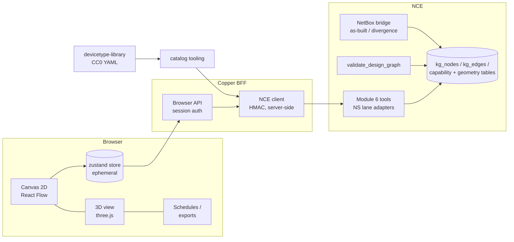

# Architecture

> **Status:** current · **Sources:** Rev 2 build proposal (2026-08-26), NCE seam audit (2026-08-28), steps-ai Romtegning survey (2026-08-28) · **Binding ADRs:** 0001, 0002, 0005, 0006

## What Copper is

The system design and integration front end for AV + IT, running on NCE. L1-first: the physical layer — devices, ports, cables, racks, locations — is the model; the schematic, the rack elevation, the 3D view, the cable schedule and every export are **projections of one document**, and that document is a projection of **NCE's graph**.

## The layers

| Layer | Lives in | Rules |
|---|---|---|
| **Store** | NCE (`kg_nodes`/`kg_edges` + Module 6 side-tables) | The only persistence. ADR-0001. Writes go through Module 6 owner tools (Contract A) |
| **Seam** | NCE, landed by the NS lane | MCP tool + REST route pairs wrapping the existing `do_author_*` / `_fetch_*` / `validate_design_graph` domain layer. Registered in BOTH `tool_registry.py` and `mcp_stdio_tools.py` |
| **BFF** | `bff/` (TypeScript, Hono) | Holds `NCE_API_KEY`, speaks REST+HMAC server-side (NCE has no browser path: no CORS, stdio-only MCP). Exposes a browser-safe session API. Stateless — no DB |
| **Document** | `app/src/model/` | NetBox-shaped types (ADR-0006): DeviceType templates → Device instances with owned components; front/rear port mapping; Site→Location→Rack; status lifecycle; signal extension layer beside the core |
| **Projections** | `app/src/{editor,views,exchange}/` | `toFlow()` for the 2D canvas, the 3D scene builder, print, DXF, cable schedule, NetBox export — all pure functions of (document, layout), guaranteed to agree |
| **Layout & routing** | `app/src/layout/` | elkjs placement + Copper's own A*-grid cable router (clean-room; ADR-0005). Quality measured by the headless rig against the 15 real fixture sheets |
| **Catalog** | `catalog/` | devicetype-library (CC0) vendored + parsed; Bravo AV types authored in the same format under CC0 for upstream contribution |

## The loop it closes (Rev 2 §05)

Draw (Copper, `status=planned`) → validate (`validate_design_graph` + physical validators) → promote (human gate → `active`) → BOM lines (design-generated origination path, Contract A via owner tools) → order/deliver (NCE M1) → install/test (`INSTALLED`/`TESTED` as evidence, AVIXA verification) → as-built (NetBox bridge `promoted_to_asbuilt`) → capture (Engine 18) → **divergence reopens the design**. Copper owns box one and the projections; NCE owns everything else already.

## Standards, three ways (Rev 2 §03)

- **Compute against:** AVIXA DISCAS/audio coverage, IEEE 802.3 PoE classes, TIA-568 channel length, HDCP chains, ST 2110 bandwidth — the V-lane validators.
- **Exchange through:** NetBox schema + devicetype-library, DXF/DWG, IFC/COBie, D365 FL, glTF/Collada (3D), MasterFormat Div 27/28 (later).
- **Observe through:** LLDP/SNMP/gNMI via Engine 18, NMOS IS-04/05 (later), AVIXA performance verification as the meaning of `TESTED`.

Underneath all three: one derived reference designation (ADR-0004) as the join key across drawing, label, BOM, D365 and capture.

## CAD/BIM workflow integrations (the W lane)

Designers live in Vectorworks, architects in Revit, visualization often in SketchUp. Copper does not replace those — it is the L1 source of truth they draw against, reached through **plugins that are ordinary clients of the BFF API** (ADR-0006 §9: the canvas is one client among several; so is a VW plugin).

| Tool | Path in/out | Mechanism |
|---|---|---|
| **Vectorworks** (priority — the AV industry's home) | DXF/DWG plates + a **VW plugin** (embedded Python) that pulls device/cable/rack data from the Copper API into the drawing and pushes placed positions back; **ConnectCAD** gets the NetBox treatment — a schema mapping for its device/circuit model so signal-flow data round-trips | Plugin + documented exchange formats (verified in W.W1 recon before anything is designed against them) |
| **Revit** | IFC/COBie export with reference designations first; Revit/Dynamo consuming the Copper API later; device types → shared parameters/type catalogs | IFC now, native later |
| **SketchUp** | The 3D lane's scene exported as glTF/Collada (racks/devices as dimensioned boxes with metadata); optional Ruby extension later | Export first, plugin later |

Rule: every plugin reads/writes through the same API and the same reference designations — no side-channel files, no plugin-private state. A position placed in VW and a position placed on the Copper canvas are the same fact in NCE.

## What Copper deliberately does NOT do

- No database, no save files, no offline mode (ADR-0001).
- No NetBox runtime, no NetBox REST emulation, no background sync (ADR-0006 keeps the schema compatible so the one-shot doors stay near-mechanical).
- No code from EasySchematic or the three AGPL-derived steps-ai files, ever (ADR-0005 FORBIDDEN list).
- No autonomy: every world-write is human-confirmed (Contract B posture); promote and BOM emission ship confirm-first.
