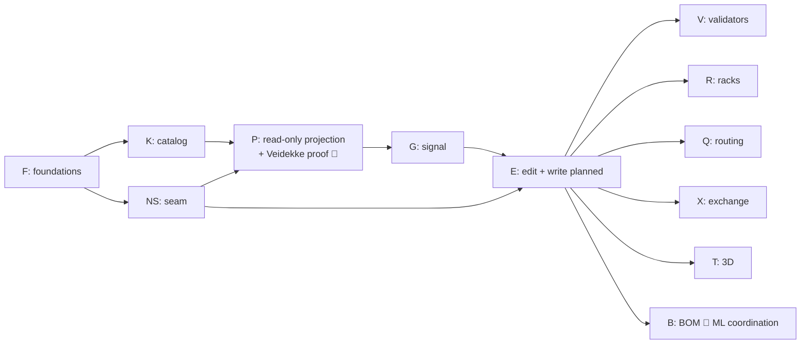

# Copper development plan

> **Status:** current · **Date:** 2026-08-28 · **Execution:** orchestrated promptwave ledger — [orchestration/CL.md](https://github.com/sindrehaugen/Copper/blob/main/orchestration/CL.md) · **Executor:** Gemini Flash 3.7 High in Antigravity (turbo), strong-Gemini orchestrator, fresh-session auditors

## 1. Objectives and non-goals

**Objective:** Copper is **the front end for the NCE vertical suite** (ADR-0007) — the cockpit of an AV/IT/network-operations business run tech-first, shaped for the EU/Nordic market (ADR-0008). Its flagship surface: a production-grade design canvas where an engineer draws an AV+IT system as live NCE data (NetBox methodology throughout, ADR-0006), gets standards-computed validation while drawing, and feeds the design-generated quote path — routing/drawing quality measured against the 15 real customer sheets, never eyeballed. Module surfaces beyond design are added evidence-first (inventory both sides: what NCE exposes, what the Portal's existing screens already prove) with Sindre picking the order at HS-8.

**Non-goals (this plan):** NMOS observe integrations, autonomy of any kind, public multi-tenant hardening, offline mode, replacing any Portal capability before a wired equivalent exists (the FE-boundary rule).

## 2. Ground truths the plan is built on (all verified 2026-08-28)

1. **NCE Module 6's domain layer exists; its external surface does not.** `do_author_device_topology`, `do_author_functional_location`, `validate_design_graph` and the topology read queries are implemented and test-covered — and unreachable by any MCP tool, REST route, or A2A skill. ML.md's own defect sweep names this shape ("surface hole") and never scheduled the fix for Module 6. Details + traps: [nce_seam_audit.md](nce_seam_audit.md). **Execution (2026-08-28): the fix is handed to the NCE ML orchestrator as the [Module 6 completion guide](m6_completion_guide.md)** — Sindre pushes it up front in the ML queue. Copper's NS lane holds `[HOLD-ML]`: at each Copper boot the orchestrator content-verifies which M6 completion waves landed on NCE `main`, consumes those, and executes only what ML did not adopt.
2. **No browser path into NCE exists** (stdio-only MCP, HMAC REST, no CORS) → Copper ships a stateless **BFF**, using NCE's two sanctioned seams (NCE-FE-1 `extra_routes`, NCE-FE-2 `register_tool`) — never a fork of `nce/`.
3. **Romtegning (steps-ai) is proven prior art.** Its clean files are ported to TS (ADR-0005 PORT list), its AGPL-derived router/scorer/compat-table are reimplemented clean-room (PATTERN list), its measured domain lessons (grid pitch, three-independent-port-facts, per-instance port overrides, confirm-warn, the four forbidden routing optimizations) are binding, and its 15 anonymized fixture sheets become Copper's quality ground truth. Its 3D room view (three.js) proves the 3D lane is another pure projection of the same document.
4. **Missing entirely, everywhere:** delete/patch of design objects, geometry storage, lifecycle status, BOM_LINE implementation. These are designed decisions (ADR-0003 + three HARD-STOPs: HS-1 status, HS-2 delete, HS-5 BOM), not incidental waves.
5. **Identity, tenancy and deployment were audit-found holes, now owned:** ADR-0011 (Entra ID OIDC via the BFF, session→namespace validation, `actor` on writes — HS-9) and ADR-0012 (internal-only, EU-resident posture). The graph↔document codec and a contract-drift gate are explicit waves (B76/B77), not assumptions.

## 3. Lanes

| Lane | Repo | What | Waves |
|---|---|---|---|
| **F** Foundations | Copper | scaffold, CI, licence gate, geometry ratchet, schema core, fixtures + rig skeleton | B1–B6 |
| **K** Catalog | Copper | devicetype-library vendoring + parser, Bravo AV authoring format (CC0, upstreamable), seed set | B7–B10 |
| **NS** NCE seam | **NCE** (worktree `NCE-Copper`, branch `copper/*`, PR to `main`) | read/author/validate adapters, geometry table, status lifecycle, cable fix, delete design | B11–B18 |
| **P** Projection | Copper | BFF, typed NCE client, toFlow, read-only canvas, ELK layout, cable schedule, **Veidekke proof**, graph↔document codec, contract-pin + fixture seam server | B19–B26, B76–B77 |
| **G** Signal model | Copper | signal classes, clean-room compat table, two-axis validation, port overrides | B27–B30 |
| **E** Editing & writes | Copper | zustand store, palette, connect gesture, write-through (`planned`), promote | B31–B35 |
| **V** Validators | Copper (+NS mirrors) | PoE, channel length, rack fit, port occupancy, HDCP | B36–B40 |
| **R** Racks & rooms | Copper | rack model, **rack elevation (net-new)**, rack editing, location tree | B41–B44 |
| **Q** Routing quality | Copper | clean-room A* router (split core/integration) → penalty zones → bundling → outside-in score → portfolio/worker → CI rig ratchet → Playwright visual regression | B45/B45b–B50, B78, then continuous |
| **T** 3D | Copper | three.js scene from the same document/layout: rooms, racks, devices; camera/print | B51–B53 |
| **X** Exchange | Copper (+NS) | DXF (MIT port), EasySchematic-format import, NetBox export/import, D365 FL import | B54–B58 |
| **B** BOM | NCE + Copper | BOM_LINE contract (**coordinate with ML** — B132a territory), design→BOM emission | B59–B60 |
| **W** CAD/BIM workflows | Copper + plugin repos | W.W1 recon (verify VW/ConnectCAD/Revit/SketchUp exchange formats — nothing designed against unverified seams), glTF/Collada export from the T lane, IFC/COBie with reference designations, **Vectorworks plugin** (embedded Python, pulls devices/cables from the BFF API, pushes placements back), ConnectCAD schema mapping (the NetBox treatment for its device/circuit model), SketchUp path, Revit/Dynamo path | B61–B67 |
| **U** Shell & platform | Copper | **M3 token foundation (ADR-0009: OS-following dark/light, copper seed)**, app shell (navigation, session, tenancy, **i18n nb-NO/en from wave one**), **accessibility ratchets** (EN 301 549/WCAG AA), allowlisted BFF module-route proxy (T3 security surface), **auth-session (ADR-0011, HS-9)** | B68/B68b–B70, B75 |
| **M** Module surfaces | Copper | M.W0 two-sided inventory: (a) what every NCE engine exposes today (seam-audit method suite-wide), (b) what the Portal's screens already prove (quote spreadsheet, customer/location trees, room-sign flow, product picker — PORT/PATTERN verdicts per screen, ADR-0005 method) → 🛑 HS-8 Sindre picks surface order; then per-surface waves (sales/quote, project, assets, inventory, netops…), each naming the Portal capability it supersedes or explicitly doesn't | B71 + unscheduled |
| **C** Compliance surfaces | Copper | DSAR surface over NCE `me_app`, provenance/audit viewer (C9a citations as UI), AI-transparency dialogs (Contract B posture made visible, EU-AI-Act-aligned) | B72–B74 (post-HS-8) |
| **O** Observe | both | divergence overlay (Engine 18), RMM health (Engine 19) | unscheduled tail |

Wave rows live in the ledger (near-horizon rows carry full `Files:`/Goal/Acceptance detail; a row cannot be dispatched until its detail line exists); briefs for **B1–B6, B4b, and B12–B14** are pre-authored in `orchestration/prompts/`, all later briefs are authored by the orchestrator at dispatch from the ledger row + `_TEMPLATE.md` (deliberate anti-rot deviation from ML practice — NCE ML.md §7.6/§7.8 incidents).

## 4. Sequencing (critical path, not numeric)

At boot, **B1 (F), B11 (NS recon) and B61 (W recon) run in parallel** — B11's work is in the NCE repo, the other lanes in Copper; K and U unlock behind B1, and Copper-side parallelism is governed by disjoint `Files:` + the chokepoint locks (`orchestration/_ORCHESTRATOR.md` §7 is the single chokepoint list). The **Veidekke read-only proof (B26)** is the premise checkpoint: real site, real nodes, auto-layout, cable schedule out, with measurable pass criteria on its row — the cheapest way to discover the L1-first premise is wrong (Rev 2 §07). Q is a continuous track after the router ships; quality is ratcheted by the rig, never by taste. While NS scope sits with ML, the P lane develops against B77's recorded-fixture seam server; only B26 requires the real thing.

## 5. HARD-STOPs (Sindre's gates — the orchestrator pauses, reports, waits)

| Gate | Before | What Sindre decides |
|---|---|---|
| 🛑 HS-1 | NS.W7 (B17) | ADR-0003 draft semantics sign-off (status vocabulary + revisions concept) |
| 🛑 HS-2 | NS.W8 (B18) | Delete semantics for design objects (WORM/audit implications — one-way door) |
| 🛑 HS-3 | after B26 | Premise check: does the Veidekke projection hold up? GO/NO-GO for the E lane |
| 🛑 HS-4 | B35 promote | Promote flow review (first `action_approval_queue` writer) |
| 🛑 HS-5 | B59 | BOM_LINE: adopt-into-ML vs Copper-funded — cross-orchestrator coordination |
| 🛑 HS-6 | X.W3/W4 | First NetBox export/import against a real NetBox — data leaves the system |
| 🛑 HS-7 | W lane post-recon | Which CAD integrations to fund first, based on W.W1's verified format findings (VW plugin is the presumed priority) |
| 🛑 HS-8 | M lane post-inventory | Which module surfaces to build, in what order, from B71's two-sided inventory (NCE surfaces × Portal prior art) |
| 🛑 HS-9 | B75 (auth) and thereby all writes | ADR-0011 identity/session/tenancy sign-off (Entra ID recommendation) |

## 6. Quality machinery (what makes it *extremely good*)

- **Measured, never eyeballed:** the headless rig (B6, ratcheted at B50) scores every layout/routing change against the 15 real sheets in CI; a routing PR that worsens the score fails. The four forbidden optimizations are pre-registered as known false wins.
- **Ratchets over review:** grid-pitch multiples test (B3), licence gate + forbidden-source scan (B2), NetBox-vocabulary check in the TAG audit, tool-count tests on the NCE side edited deliberately per NS wave.
- **RED-first evidence everywhere:** §6.4 mutation tables are mandatory in every coder report and re-verified by auditors (NCE's confounded-test lesson, imported wholesale).
- **Writer ≠ approver, always:** fresh-session TAG audits, risk-tiered T1/T2/T3 with refutation passes on one-way doors.
- **Schema honesty:** every model field cites its NetBox source or declares itself an extension (ADR-0006) — drift from the methodology is a gate failure, not a style nit.
- **Run it, don't just test it:** B26 and every NS integration wave execute against the live local NCE stack from the orchestrator seat (workers' sandboxes mask failures — NCE RL lesson).

## 7. Efficiency machinery (what makes it *fast*)

- **10–25 min waves, split at dispatch** (`_ORCHESTRATOR.md` §7 sizing rules): every dispatched brief is one concern with explicit paths and no open design decision — open decisions live in ADRs and HARD-STOPs, never inside a Flash wave.
- **Parallel from minute one** (B1/B11/B61 across two repos), then `Files:`-disjoint parallelism inside Copper with the chokepoint locks (single list: `_ORCHESTRATOR.md` §7) serializing the rest.
- **Audit overlaps the next dispatch** (§6.2) — the gate is never a barrier.
- **T1 waves skip the separate reviewer** when the coder ran the full gate (recorded risk acceptance, same terms as NCE's).
- **Port, don't invent:** the PORT list means the document model, projection, DXF, migrations funnel and rig harness arrive as translations of proven code, with typing as the review.
- **Orchestrator-authored briefs at dispatch time** kill the brief-rot tax that cost NCE multi-hundred-file correction sweeps.

## 8. Risks, named

1. **NS lane lands in a repo the ML orchestrator also writes** → own worktree, `copper/*` branches, rebase-before-PR, §7.4 discipline; BOM lane requires explicit coordination (HS-5).
2. **The L1-first premise could still be wrong** for loose/non-networked kit → B26 checkpoint exists to fail cheap; the fallback is Rev 2's documented reconsideration, not denial.
3. **Clean-room drift** — an agent "helpfully" opening a forbidden file → path bans in briefs, Norwegian-identifier + structure heuristics in the TAG audit, licence gate in CI, and the orchestrator never pastes forbidden content into any brief.
4. **Turbo mode auto-running the wrong thing** → template rule 9 (no push/PR/merge/network mutations from coders), orchestrator owns commits, Antigravity auto-commit disabled across the writer/approver line.
5. **devicetype-library covers IT, not AV** (verified: 314 manufacturers, ~3 meaningful AV) → K.W4 seeds Bravo's brands; the AV catalogue is a standing content track, budgeted as such, contributed upstream under CC0.
6. **The P/E critical path waits on another orchestrator's queue** (NS scope is with ML) → B77's fixture seam keeps B21–B25 and E-lane development unblocked against recorded contract shapes; only B26 needs the real seam. If ML has not landed M6.W13a–W14 within a sensible window, Sindre decides at boot whether NS waves return to Copper execution.
7. **nb-NO translation is a standing content track** (like the AV catalogue): copy is externalized from B68b, but someone must write and QA the Norwegian — budget it, don't discover it.
